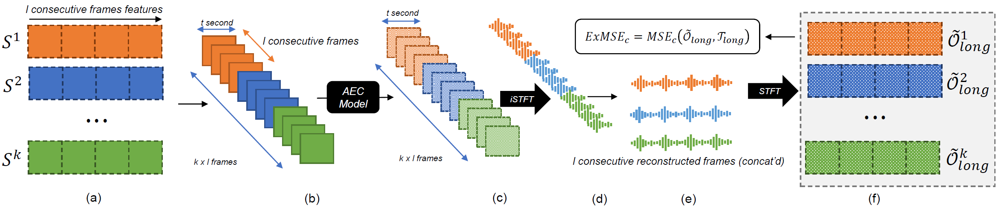

# Extended Loss: Incorporating Long Context into Training Models when using Short Audio Frames

[Quang Minh Dinh](https://github.com/quangminhdinh), [Mehrdad Hosseinzadeh](https://github.com/mehrdad-h), [Hoda Rezaee Kaviani](https://github.com/hodarezaee), [Yuanhao Yu](./#)
